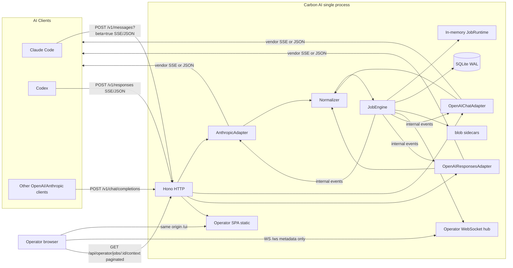
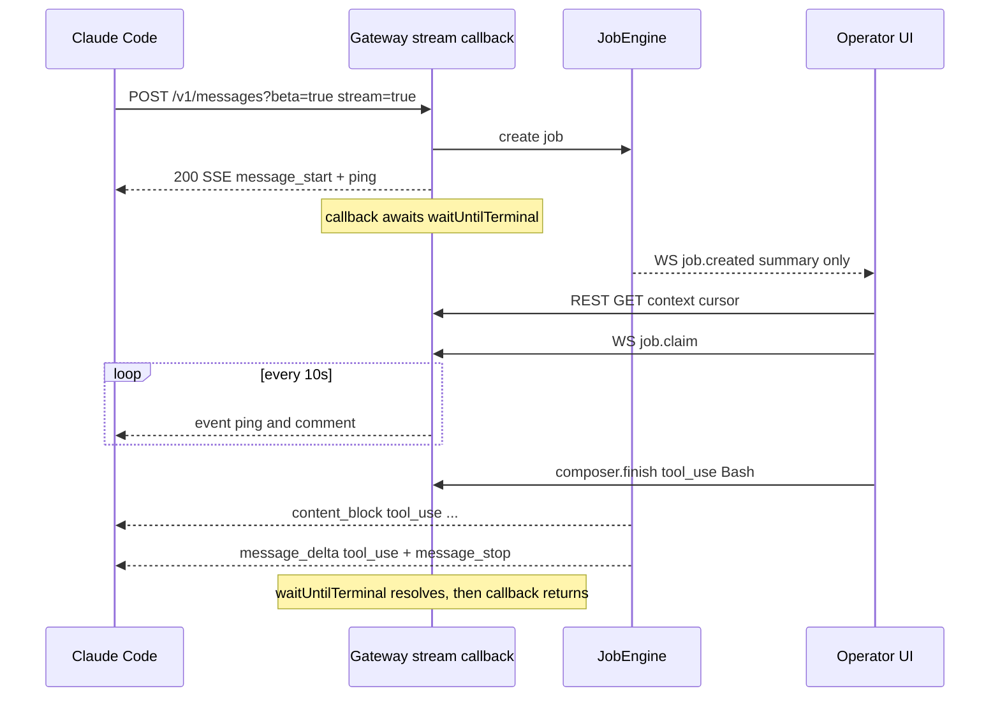
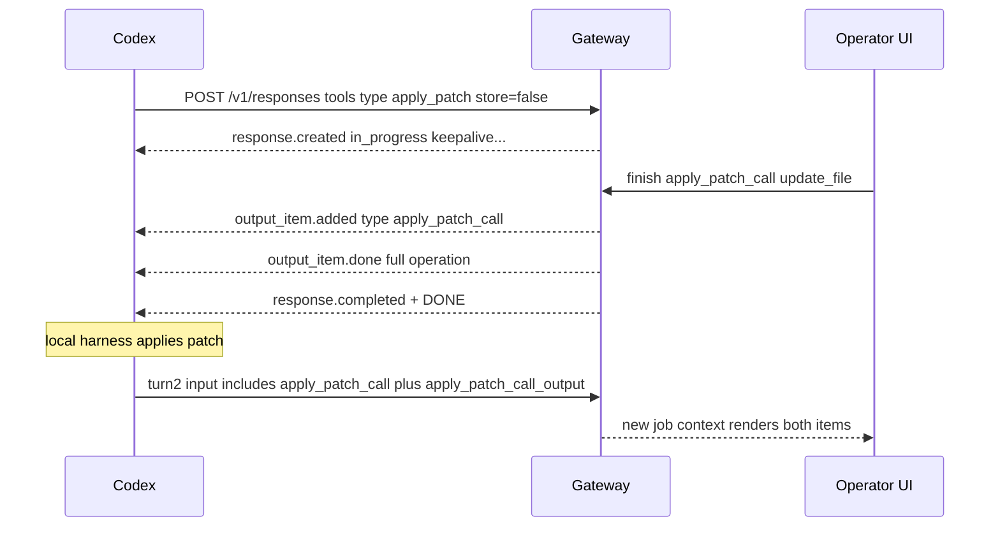

# Carbon AI：把操作者本人包装为 Claude Code / Codex 兼容模型 API

| 字段 | 值 |
|---|---|
| 文档标题 | Carbon AI Design |
| 产品名 | **Carbon AI**（中文：**碳基智能**） |
| 作者 | TBD |
| 日期 | 2026-08-22 |
| 状态 | Draft（rev 4 + 用户决策 2026-08-22：`max_active=8`；Responses 心跳 comment + `keepalive`） |
| 仓库 | `/Users/YangYongAn/FlyDog/CarbonAI`（当前为空的 greenfield；下文路径均为**拟建**，不表示仓库里已有这些文件） |
| 语言约束 | 实现栈**禁止 Python**（含运行时、操作台、随产品发布的脚本、推荐语言） |

---

## Overview

Carbon AI 是一个本机 / 私有部署的 HTTP 网关：AI 编程客户端（Claude Code、Codex、以及其他走 Anthropic Messages / OpenAI Chat Completions / OpenAI Responses 的工具）把它当成模型 API 来用。网关**不调用任何 LLM**。入站的 `messages` / `chat/completions` / `responses` 请求被规范化成「操作者任务」（job）；操作者在 Web 控制台里阅读完整上下文，用键盘和/或浏览器语音识别作答；网关把该回答以对应厂商的 JSON 或 SSE 形态写回正在等待的客户端，看起来就像模型生成的一样。

成败标准是**客户端兼容性**（Claude Code 与 Codex 能跑完真实 tool loop），不是仪表盘美观。协议适配器是一等公民：内部事件流携带文本、思考块、以及**厂商原生工具种类**（Anthropic `tool_use`、OpenAI `function`、Responses `function_call` / `custom_tool_call` / `apply_patch_call` / `local_shell_call` / `shell_call`），再由三个出口适配器投影。流式 HTTP 回调必须挂起直到 job 终态；accept 后 50ms 内打出首个 SSE 帧，并按协议发送心跳，以便操作者用「人」的时间思考。

---

## Background & Motivation

### Product origin / 产品由来

An independent developer, working across time zones, had coding agents with no usable API and no token — so they sat idle. Remote pairing still needed a human operator behind someone else's agent, with that agent collecting local facts when the session required them. Carbon AI packages the operator as a drop-in model endpoint for any client that speaks Anthropic Messages or OpenAI-compatible HTTP (Claude Code, Codex, DeepSeek-style agents, and others).

面向国际协作的独立开发者：手头的智能体没有可用的 API 和 Token，因此闲置；远程结对仍需要人工操作者坐在对方 agent 后面，并由对方 agent 在需要时采集现场信息。Carbon AI 把操作者包装成可直接调用的模型接口，面向任何走 Anthropic Messages 或 OpenAI 兼容协议的客户端（Claude Code、Codex、DeepSeek 类智能体等）。

Off-the-shelf LLM gateways (LiteLLM and similar) go the other way: they proxy to a real model, and many implementations are Python. Carbon AI calls no LLM.
现成的 LLM 网关（LiteLLM 等）方向相反：它们把请求转给真实模型，且大量实现是 Python。Carbon AI 不调用任何 LLM。

### 工程约束

痛点：

1. 编程 Agent 的系统提示极大（Claude Code 常见 50k–200k+ tokens），必须原样展示给操作者，但不能把整段 prompt 打到 stdout、WebSocket 或一次性塞进 DOM。
2. 客户端对 SSE 事件顺序、心跳、错误信封、**工具 item 的 `type`** 极其敏感；把 Codex 的 `apply_patch` 投影成名为 `apply_patch` 的 `function_call` 会让本地 handler 根本不跑。
3. Codex 新版本要求 `wire_api = "responses"`，只做 Chat Completions 会直接启动失败。Codex **今天不走** `previous_response_id`：它把上一轮 output items（含 tool 调用）整段塞回 `input`，且常用 `store: false` + `include: ["reasoning.encrypted_content"]`。
4. 人的 TTFT 是秒到分钟；Claude Code 在自定义 `ANTHROPIC_BASE_URL` 上有 **300s 字节看门狗**（comment 也算字节）；Codex 默认 `stream_idle_timeout_ms = 300000`；nginx 默认 `proxy_read_timeout = 60s`。
5. Hono `streamSSE` 在回调 resolve 时关闭 HTTP body；Bun 历史上对客户端 TCP 断开不一定触发 `ReadableStream.cancel()`。这两点不先钉死，后面所有适配器都是假绿灯。

---

## Goals & Non-Goals

### Goals（v1）

- 作为 drop-in API：Anthropic Messages、OpenAI Chat Completions、OpenAI Responses；各自的 stream 与 non-stream。
- **真实 tool loop**：Claude Code 的 `Bash`/`Read`/`Edit`/…（Anthropic `tool_use`）；Codex 的 `apply_patch_call`、`local_shell_call`/`shell_call`、`function_call`、`custom_tool_call`。禁止把非 function 工具静默映射成 `function_call`。
- 操作台：实时 inbox、按块分页的上下文、回复撰写（键盘 + 浏览器 Web Speech API）、带校验的 tool 编辑器（模板 + JSON.parse 门闩）。
- 单操作者；默认最多 **8** 路 `claimed|streaming`（覆盖更多 Claude Code subagent / 多客户端），claim/lock 防止两个标签双写**同一** job。Inbox 可在最多 8 路之间切换；每 job 仍只有一个 writer。
- 流式心跳（分协议）、客户端断开取消、操作者离线可配置等待或快速 503。
- 用 **golden SSE fixtures + 伪客户端 HTTP 脚本**（TypeScript）锁住协议。协议 PR 必须带 HTTP 模拟器，而不是等文档 PR。

### Non-Goals（v1 明确不做）

- 不是真实 LLM 网关，不代理到 OpenAI / Anthropic / 任何模型。
- 不是多操作者市场、不是排队派单平台。
- 不实现全部 vendor beta 的计费语义（prompt caching 的 cache 读写 tokens 恒为 0；computer-use 截图循环只**渲染**，由人手工处理）。v1 **不发射** `computer_call` / `file_search_call` / `web_search_call` / `mcp_*` / `image_generation_call` / `code_interpreter_call` 作为模型输出；请求里若 *只* 含这些不可发射种类则 400，而不是伪装成 function。
- 不做 embeddings、image generation、audio transcription、batches、fine-tuning、Assistants API。
- 不实现 Responses `background: true`（因此 `POST /v1/responses/:id/cancel` 对 v1 返回 409）。
- 不追求每个未文档化字段的字节级一致。
- 不做原生移动端。
- **不使用 Python**（被拒绝的原因：用户明确禁止，不是技术评估结果）。

---

## 推荐实现栈

**决定：语言是 TypeScript 全仓。运行时默认尝试 Bun，但以 PR 1 的 SSE 挂起 + 客户端 abort 尖峰测试为 go/no-go。尖峰失败则 v1 改用 Node 22，而不是把 Node 留给「以后重写」。Python 禁止。**

| 层 | 选择 | 理由 |
|---|---|---|
| Language | **TypeScript** | 协议 fixture、gateway、操作台同一语言。满足「禁止 Python」，**并不**要求 Bun。 |
| Runtime（意向） | **Bun 1.2+** 若 PR 1 尖峰通过；否则 **Node 22** + `@hono/node-server` + `better-sqlite3` + `ws` | Bun 的 sqlite/WS 是样板优势，不是吞吐优势（QPS 是人）。Bun 对 `ReadableStream.cancel()` / 请求 abort 有历史缺口（oven-sh/bun#6758）。 |
| HTTP | **Hono** | 中间件轻。**厂商 SSE 帧不走 `stream.writeSSE`**（它不保证 comment、也不保证 Chat 那种无 `event:` 行）。用 Hono `stream()` 拿到 writable，字节由 `SseWriter` 写。`streamSSE` 回调 resolve 即关流，见下方不变量。 |
| 操作台 | **Vite + React + TypeScript** | 虚拟列表、IME、Web Speech API。v1 语音**只用** `SpeechRecognition`（`zh-CN` + `en-US`）。 |
| DB | **SQLite WAL** + Drizzle；驱动随 runtime（`bun:sqlite` 或 `better-sqlite3`） | 单文件、零运维。 |
| 实时 | 操作台 ←WebSocket→ gateway（**只传元数据**）；客户端 ←SSE→ gateway | 完整 prompt 走分页 REST。 |
| Monorepo | Bun workspaces（Node 模式下同样的 `package.json` workspaces + `tsx`/`node --watch`） | `apps/gateway` + `apps/operator` + `packages/protocol` + `packages/db` + `packages/config`。 |

**不选 Python**：用户硬约束。FastAPI / Django / Flask / uvicorn 全部排除。

Go（`net/http` 或 Fiber + 小型 React UI）作为严肃备选，见 [Alternatives Considered](#alternatives-considered)。v1 **不**双语言。

### PR 1 尖峰（runtime go/no-go）

在写任何厂商适配器之前，gateway 必须用**真实 HTTP 客户端**（`fetch` 或 `curl` 子进程，禁止只测 `adapter.toSse`）证明：

1. `GET /debug/sse-hang` 在 `return stream()` **之前**设四条 SSE 头；立即 200；`assert(res.headers.get("content-type")?.toLowerCase().startsWith("text/event-stream"))`；每 1s 写 `: ping` 与 `data: {"t":N}`，持续 ≥ 60s；客户端在第 2s 读到第一字节（证明未 gzip/缓冲整段）；**最后一帧先于 body end**。
2. 客户端在第 5s SIGINT/abort；服务端在 **N=2s** 内把对应 job 标 `cancelled`（先用内存计数器，PR 2 换成 JobEngine）。
3. 探测路径：`c.req.raw.signal`、Hono `stream.onAbort`、以及「写 ping 抛错 → 视为断开」。三条有一条可靠即可；**三条全静默则 Bun 出局，v1 切 Node 22**。
4. 双栈：`http://127.0.0.1:12580/health` 与 `http://[::1]:12580/health` 都 200。README 同时写 `127.0.0.1`（首选）并说明 `localhost` 因 `::1` 已监听所以可用。

`bun --watch` vs `tsx` 是工具差异，不是架构差异。

---

## Proposed Design

### 逻辑架构



一个进程同时：

1. 对外暴露厂商兼容 HTTP。
2. 对内提供操作台静态资源（生产把 `apps/operator` 的 `dist/` 挂到 `/ui`）。`GET /` → **302 `/ui/`**；`/ui/*` SPA history fallback 到 `index.html`。
3. `/ws` 给操作台（元数据）。
4. 数据目录默认 `~/.carbon-ai/`（避开 Desktop / iCloud），SQLite `~/.carbon-ai/carbon.db`，blob `~/.carbon-ai/blobs/`。

默认监听 **IPv4 与 IPv6 环回**：`127.0.0.1:12580` 与 `[::1]:12580`（配置 `host = "loopback"`）。不绑定 LAN。单操作者、低 QPS：不引入 Redis。

### 仓库布局（拟建）

```text
/Users/YangYongAn/FlyDog/CarbonAI/
  package.json
  bun.lock                     # 若 runtime=bun
  tsconfig.base.json
  carbon.toml
  README.md                    # PR 1 就写可工作的 http://127.0.0.1:12580
  apps/gateway/src/
    index.ts                   # serve + dual-stack bind + compress skip
    http/sse-pipe.ts           # Hono stream() + waitUntilTerminal
    routes/{anthropic,openai-chat,openai-responses,models,health,hello,operator-api}.ts
    job/{engine,runtime,sse-writer,coalescer}.ts
    ws/hub.ts
    auth/{client-keys,operator-session}.ts
  apps/operator/src/
    inbox/Inbox.tsx
    context/{ConversationView,RawJsonPanel}.tsx
    composer/{Composer,ToolEditor,VoiceButton,templates.ts}.tsx
    ws/client.ts
  packages/protocol/
    src/{ids,tokens,events,fold}.ts
    src/normalize/{anthropic,openai-chat,openai-responses}.ts
    src/adapters/*.ts
    src/errors/{anthropic,openai}.ts
    fixtures/anthropic/{text,tool_use,mixed_text_tool,ping_only,error,cjk}.sse
    fixtures/openai-chat/{text,tool_only,include_usage,error,cjk}.sse
    fixtures/openai-responses/{text,function_call,apply_patch_call,function_apply_patch,custom_apply_patch,local_shell_call,custom_tool_call,keepalive,store_false_turn2,cjk}.sse
  packages/db/src/{schema,migrate}.ts
  packages/config/src/load.ts
  scripts/sim-claude-code.ts   # 随 PR 3 落地
  scripts/sim-codex.ts         # 随 PR 5 落地
  docs/clients.md              # PR 10；URL 从 PR 1 README 已可抄
```

开发：gateway + Vite 代理 `/v1`、`/ws`、`/api`。生产：gateway 托管 SPA。

---

## 内部数据：工具种类、NormalizedRequest、InternalEvent

所有厂商请求先变成 `NormalizedRequest`。操作者输出先变成 `InternalEvent[]`，再由适配器投影。**禁止**在路由层手写 SSE 字符串。**禁止**把未知/非 JSON 工具种类折叠成 `function_call`。

```ts
// packages/protocol/src/events.ts

export type Protocol =
  | "anthropic_messages"
  | "openai_chat"
  | "openai_responses";

/** v1 可发射的工具种类。请求里出现但不在此列的，见「未知工具策略」。 */
export type ToolKind =
  | "anthropic_tool_use" // Anthropic tools[] 函数；输出 content_block type=tool_use
  | "openai_function"    // Chat tools[] type=function，或 Responses tools[] type=function
  | "openai_custom"      // Responses tools[] type=custom；输出 custom_tool_call
  | "apply_patch"        // tools: [{type:"apply_patch"}] → apply_patch_call
  | "local_shell"        // tools: [{type:"local_shell"}] → local_shell_call
  | "shell";             // tools: [{type:"shell"}] → shell_call

export type ContentPart =
  | { type: "text"; text: string }
  | {
      type: "image";
      mediaType: string;
      source: "base64" | "url";
      byteLength: number;
      sha256?: string; // sidecar；normalized 永不内嵌 base64
      url?: string;
    }
  | {
      type: "document";
      title?: string;
      mediaType: string;
      byteLength: number;
      sha256?: string;
      excerpt?: string;
    }
  | {
      type: "tool_use";
      kind: ToolKind;
      id: string;
      callId: string;
      name?: string;
      payload: ToolPayload;
    }
  | {
      type: "tool_result";
      kind: ToolKind | "unknown";
      toolUseId: string;
      callId?: string;
      isError?: boolean;
      content: ContentPart[];
      vendorRaw?: unknown; // apply_patch_call_output 等原样保留
    }
  | {
      type: "reasoning";
      id: string;
      summary: { type: "summary_text"; text: string }[];
      encryptedContent?: string;
    }
  | { type: "thinking"; thinking: string; signature?: string }
  | { type: "redacted_thinking"; data: string }
  | { type: "unknown"; vendorType: string; raw: unknown };

export type ApplyPatchOp =
  | { type: "create_file"; path: string; diff: string }
  | { type: "update_file"; path: string; diff: string }
  | { type: "delete_file"; path: string };

export type LocalShellAction = {
  type: "exec"; // 线上必填，恒为 "exec"
  command: string[];
  env: Record<string, string>; // 线上必填；操作者留空时发射 {}
  timeout_ms?: number;
  user?: string;
  working_directory?: string;
};

export type ShellAction = {
  commands: string[];
  timeout_ms?: number;
  max_output_length?: number;
};

export type ToolPayload =
  | { form: "json"; value: unknown }
  | { form: "freeform"; value: string }
  | { form: "apply_patch"; operation: ApplyPatchOp }
  | { form: "local_shell"; action: LocalShellAction }
  | { form: "shell"; action: ShellAction };

export type NormalizedMessage = {
  role: "system" | "developer" | "user" | "assistant" | "tool";
  parts: ContentPart[];
};

export type NormalizedTool =
  | {
      kind: "anthropic_tool_use" | "openai_function" | "openai_custom";
      name: string;
      description?: string;
      inputSchema?: unknown;
      vendorRaw: unknown; // 原始 tools[] 元素，适配器回放/校验用
    }
  | {
      kind: "apply_patch" | "local_shell" | "shell";
      description?: string;
      vendorRaw: unknown;
    };

export type NormalizedRequest = {
  protocol: Protocol;
  model: string;
  displayModel: string;
  system: ContentPart[];
  messages: NormalizedMessage[];
  tools: NormalizedTool[];
  toolChoice: unknown | null;
  maxTokens?: number;
  stream: boolean;
  stopSequences: string[];
  metadata: Record<string, unknown>;
  extras: Record<string, unknown>;
  previousResponseId?: string;
  store?: boolean;
  include?: string[];
  reasoning?: unknown;
  thinking?: unknown; // Anthropic thinking 请求参数
};

export type StopReason =
  | "end_turn"
  | "max_tokens"
  | "tool_use"
  | "stop_sequence";

export type InternalEvent =
  | {
      type: "job_start";
      jobId: string;
      vendorMessageId: string;
      model: string;
      createdAt: number;
      inputTokens: number;
    }
  | { type: "text_start"; blockIndex: number }
  | { type: "text_delta"; blockIndex: number; text: string }
  | { type: "text_end"; blockIndex: number }
  | {
      type: "thinking_start";
      blockIndex: number;
    }
  | { type: "thinking_delta"; blockIndex: number; text: string }
  | { type: "thinking_end"; blockIndex: number; signature?: string }
  | {
      type: "reasoning_item";
      blockIndex: number;
      id: string;
      summary: { type: "summary_text"; text: string }[];
      encryptedContent?: string;
    }
  | {
      type: "tool_call_start";
      blockIndex: number;
      kind: ToolKind;
      itemId: string;
      callId: string;
      name?: string;
    }
  | {
      type: "tool_call_delta";
      blockIndex: number;
      /** json/custom：增量字符串。apply_patch/shell：v1 不走增量（见下）。 */
      argumentsDelta: string;
    }
  | {
      type: "tool_call_end";
      blockIndex: number;
      payload: ToolPayload;
    }
  | {
      type: "stop";
      reason: StopReason;
      stopSequence?: string | null;
      outputTokens: number;
      inputTokens: number;
    }
  | { type: "error"; code: string; message: string };
```

`fold.ts`：

```ts
export type AssistantBlock =
  | { type: "text"; text: string }
  | { type: "thinking"; thinking: string; signature?: string }
  | {
      type: "reasoning";
      id: string;
      summary: { type: "summary_text"; text: string }[];
      encryptedContent?: string;
    }
  | {
      type: "tool_use";
      kind: ToolKind;
      id: string;
      callId: string;
      name?: string;
      payload: ToolPayload;
    };

export type AssistantOutput = {
  vendorMessageId: string;
  model: string;
  createdAt: number;
  blocks: AssistantBlock[];
  stopReason: StopReason;
  stopSequence?: string | null;
  inputTokens: number;
  outputTokens: number;
};

export function fold(events: InternalEvent[]): AssistantOutput { /* ... */ }
```

**不变量：** 对同一串 `InternalEvent`，`adapter.toSse(events)` 客户端累积结果与 `adapter.toJson(fold(events))` 在 `content` / `tool_calls` / `output[]` 上**语义相等**（含 item `type`、tool payload）。测试：stream fixture 再 assert fold。

### 未知工具与 thinking 策略

| 情况 | v1 行为 |
|---|---|
| `tools[]` 含 v1 可发射种类（可夹杂未知种类） | 接受；操作台只提供可发射种类的模板。未知种类在上下文里当 `ContentPart.unknown` **渲染**。 |
| `tools[]` **只**含不可发射种类（如仅 `computer_use`） | **400** 厂商信封：`unsupported tool type(s): …`。不伪装 function。 |
| 入站 item 为 `apply_patch_call_output` / `local_shell_call_output` / `function_call_output` / `custom_tool_call_output` | 必须渲染；原样进入下一轮 fold 上下文。 |
| Anthropic `thinking` / `redacted_thinking` 出现在**历史** assistant 消息 | 渲染并在 raw 中保留。操作者默认**不**新造 thinking。`emit_thinking = "never"`（默认）。若客户端因此拒下一轮，记入风险；不在 v1 伪造 signature。 |
| 请求带 Anthropic `thinking: {type:"enabled"}` | **不 400**。仍允许纯文本/tool 回复。 |
| Responses `include` 含 `reasoning.encrypted_content` | 若 `emit_empty_reasoning=auto`，reasoning item 带 **非空不透明 dummy 字符串**（稳定、可回放）。不是真实 CoT，也不是安全原语。见 Responses 节。 |

---

## API / Interface Changes

Greenfield，无「before」。未知路径：带 `anthropic-version` → Anthropic 404 信封，否则 OpenAI 信封。

### 公共 HTTP 行为

| 规则 | 行为 |
|---|---|
| 未知但无害字段 | **忽略**，不 400 |
| 缺必填 | 400，该协议 error JSON |
| `model` | **接受任意字符串**；aliases 只影响展示。Claude Code **仍必须**设 `ANTHROPIC_MODEL`（见下） |
| CORS | 默认关 |
| HTTPS | v1 本机 HTTP |
| 鉴权 | `/health`、`HEAD|/GET /api/hello`、`/ui` 静态例外。`GET /v1/models` **要**客户端 key。`/metrics` 在非 loopback 上要操作者会话 |
| 请求体上限 | `max_body_bytes` 默认 **16 MiB**。超过 → **413** 厂商信封（Anthropic `invalid_request_error`「request too large」；OpenAI `type: invalid_request_error` `code: context_length_exceeded` 不合适，用 `code: null` message `Request too large`） |
| Query string | **忽略**。`POST /v1/messages?beta=true` 与无 query 同路径 |

**协议分发：** `GET /v1/models` 与 `GET /v1/models/:id`：有 `anthropic-version` → Anthropic 形状，否则 OpenAI。支持 `?limit=1000`（忽略或切片，短列表无妨）。

### Claude Code 首连（必须写进路由表与 README）

| 行为 | 规范 |
|---|---|
| 推理 | `POST /v1/messages`，常带 `?beta=true`。匹配 **path**，忽略 query |
| `count_tokens` | **实现**（避免无谓 fallback）。对 Claude Code **不是**硬首连条件：404 时它会改用推理计数。我们仍提供，估计误差约 ±50%，文档写明 |
| 模型发现 | `GET /v1/models?limit=1000`，且仅当 `CLAUDE_CODE_ENABLE_GATEWAY_MODEL_DISCOVERY=1`。部分版本**只展示** id 以 `claude` 或 `anthropic` 开头的项 → **不要依赖发现**。操作者必须导出 `ANTHROPIC_MODEL`（以及建议的 `ANTHROPIC_DEFAULT_OPUS_MODEL` / `SONNET` / `HAIKU` / `ANTHROPIC_SMALL_FAST_MODEL`）指向自己选的 id |
| 预热 | `HEAD /api/hello`（可能还有 GET）→ **200 空 body**，不鉴权。未实现会被某些版本当失败 |
| Base URL | `ANTHROPIC_BASE_URL=http://127.0.0.1:12580`（**不要**加 `/v1`） |
| 鉴权 | `ANTHROPIC_AUTH_TOKEN`（Bearer）或 `ANTHROPIC_API_KEY`（`x-api-key`） |
| Subagents | 见 Job Engine；v1 默认 `max_active=8`（用户决策）。Inbox 可在最多 8 路 `claimed|streaming` 间切换。不熟切换器时仍可少开 teams，但 v1 **不**要求关掉 subagents |

### Anthropic Messages

#### `POST /v1/messages`

**Headers：** `x-api-key` 或 `Authorization: Bearer`；`anthropic-version` 记录但不强制；`anthropic-beta` 忽略未知。

**Body：** `model`, `system`, `messages`, `tools`, `tool_choice`, `max_tokens`, `stream`, `stop_sequences`, `metadata`, `thinking`。content blocks：`text`, `image`, `tool_use`, `tool_result`, `document`, `thinking`, `redacted_thinking`。其余 → `unknown`。

**必填：** `model`, `messages`（≥1）, `max_tokens`。缺则：

```json
{
  "type": "error",
  "error": {
    "type": "invalid_request_error",
    "message": "max_tokens: Field required"
  },
  "request_id": "req_01YouLlmReq00000000000000000"
}
```

**非流式 200：**

```json
{
  "id": "msg_01YouLlmFakeId000000000000",
  "type": "message",
  "role": "assistant",
  "model": "<echo request.model>",
  "content": [
    { "type": "text", "text": "..." },
    {
      "type": "tool_use",
      "id": "toolu_01YouLlmTool00000000000",
      "name": "Bash",
      "input": { "command": "ls" }
    }
  ],
  "stop_reason": "tool_use",
  "stop_sequence": null,
  "usage": {
    "input_tokens": 1234,
    "output_tokens": 56,
    "cache_creation_input_tokens": 0,
    "cache_read_input_tokens": 0
  }
}
```

`stop_reason`：`end_turn` | `max_tokens` | `tool_use` | `stop_sequence`。

#### Anthropic SSE 帧

```text
event: <name>
data: <compact json>

```

心跳 **每 10s** 两种都发（comment 供代理；named ping 供 SDK；二者都刷新 Claude Code **300s 字节看门狗**）：

```text
: ping

event: ping
data: {"type":"ping"}

```

#### 内部事件 → Anthropic SSE

| InternalEvent | SSE `event` | `data` 要点 | 何时 |
|---|---|---|---|
| `job_start` | `message_start` | 见下方完整 JSON；`usage.output_tokens=1` 占位；**含 cache_* = 0** | 立即 < 50ms |
| （无） | `ping` | `{"type":"ping"}` | 立即一次，之后每 10s |
| `text_start` | `content_block_start` | `index`, `{type:"text", text:""}` | 开始文本 |
| `text_delta` | `content_block_delta` | `delta: {type:"text_delta", text}` | coalesce flush |
| `text_end` | `content_block_stop` | `index` | |
| `thinking_start` | `content_block_start` | `{type:"thinking", thinking:""}` | 仅当 `emit_thinking` 打开 |
| `thinking_delta` | `content_block_delta` | `{type:"thinking_delta", thinking}` | |
| `tool_call_start` kind=`anthropic_tool_use` | `content_block_start` | `{type:"tool_use", id, name, input:{}}` | |
| `tool_call_delta` | `content_block_delta` | `{type:"input_json_delta", partial_json}` | JSON 工具；**不在 JSON 字符串/键中间乱切** 若 fake-chunk |
| `tool_call_end` | `content_block_stop` | | |
| `stop` | `message_delta` 然后 `message_stop` | `delta: {stop_reason, stop_sequence}`, `usage: {output_tokens}` **仅 output_tokens**；`message_stop`=`{"type":"message_stop"}` | |
| `error` | `error` | **精确字节见下** | 然后关流，不再发 `message_stop` |

`message_start` 完整 data（cache 零必须出现，避免 UI 读 undefined）：

```json
{
  "type": "message_start",
  "message": {
    "id": "msg_01YouLlmFakeId000000000000",
    "type": "message",
    "role": "assistant",
    "content": [],
    "model": "claude-opus-4-6",
    "stop_reason": null,
    "stop_sequence": null,
    "usage": {
      "input_tokens": 25,
      "output_tokens": 1,
      "cache_creation_input_tokens": 0,
      "cache_read_input_tokens": 0
    }
  }
}
```

**流中 error 精确字节**（timeout 用 `overloaded_error` 是有意的：语义「此刻完不成」，优于假助手消息；HTTP 529 的类型名借用到已开的 200 SSE）：

```text
event: error
data: {"type":"error","error":{"type":"overloaded_error","message":"Carbon AI operator wait timeout"}}

```

默认 **`eager_content_block = false`**，以便第一块可以是 `tool_use`。

ID：Anthropic 现网示例为 `msg_01` / `toolu_01` + `[A-Za-z0-9]`。v1 生成 `msg_01` + 24 位、`toolu_01` + 24 位、`req_01` + 24 位，字符集 `[A-Za-z0-9]`。

#### `GET /v1/models`（Anthropic）

列表包含 `carbon-default` **以及** 每个 alias。为降低发现过滤风险，默认 aliases 至少含一条 `claude-` 前缀 id（展示名仍是 Carbon AI）。**操作者仍必须设置 `ANTHROPIC_MODEL`。** `GET /v1/models/:id` 未知 id 仍 200 合成。

#### `POST /v1/messages/count_tokens`

实现；响应 `{ "input_tokens": N }`（若客户端容忍，可加 `"context_management": null`）。启发式 ±50%，非账单。Claude Code 不依赖此端点才能首连。

### OpenAI Chat Completions

#### `POST /v1/chat/completions`

**Headers：** `Authorization: Bearer`。

**Body：** `model`, `messages`, `stream`, `tools`, `tool_choice`, `functions`（**规范化进 `NormalizedTool` kind=`openai_function`**，不是只进 extras）, `max_tokens` / `max_completion_tokens`, `stop`, `stream_options.include_usage`, `user`。

**必填：** `model`, `messages`。

**非流式：** 仅 tool 时 `message.content` 必须是 `null`。`finish_reason`：`end_turn→stop`, `max_tokens→length`, `tool_use→tool_calls`, `stop_sequence→stop`。

#### Chat Completions SSE

**只有 `data:` 行，没有 `event:`。** 结束：

```text
data: [DONE]

```

心跳默认 `: ping` comment。可选 `openai_chat.heartbeat = "empty_delta"`（不带 `content` 字段的空 delta，避免 `""`）。

当 `stream_options.include_usage === true`：**每一个** chunk（含 role 首包、tool 增量）带 `"usage": null`；最后在 `[DONE]` 前发 `choices: []` + 真实 usage。

#### 内部事件 → Chat chunk

外壳：`{id, object:"chat.completion.chunk", created, model, choices:[{index:0, delta, finish_reason}]}`。若 `include_usage`，再加 `usage: null`。

| InternalEvent | `choices[0].delta` | 备注 |
|---|---|---|
| `job_start` | `{ "role": "assistant" }` **不要 `content` 键** | 立即。Tool-only 流不得出现 `content:""`，否则 fold 出 `""` 而非 `null`，部分 SDK 会跳过 tool |
| `text_delta` | `{ "content": text }` | 第一次 text 才引入 content |
| `tool_call_start` | `{ tool_calls: [{ index, id, type:"function", function:{ name, arguments:"" } }] }` | `index` 为 Chat tool 序号，与 Anthropic `blockIndex` 独立 |
| `tool_call_delta` | `{ tool_calls: [{ index, function:{ arguments } }] }` | 不重复 id/name |
| `stop` | `{}` + `finish_reason` | 然后 usage 末包（若需要）+ `[DONE]` |
| `error` | **精确字节见下** | 不混入非 SSE JSON；**不发 `[DONE]`** |

fold：没有任何 `text_delta` 且有 tool → JSON `content: null`。`kind=openai_function` 且名为 `apply_patch` 时，流式 `arguments` 增量与非流式 `arguments` 都是 **对象 JSON 字符串**（`JSON.stringify({input: beginPatch})`），不是 Begin Patch 原文。详见 Responses 节 B2。

**流中 error 精确字节：**

```text
data: {"error":{"message":"Carbon AI operator wait timeout","type":"server_error","param":null,"code":"timeout"}}

```

然后 **close**，不发 `[DONE]`。配置 `openai_chat.midstream_error = "error_chunk" | "silent_close"`（默认 `error_chunk`）。官方 `openai` npm 对 `data: {error}` 会抛；Codex 不走 Chat。禁止在已开的 `text/event-stream` 里改写裸 JSON body。

### OpenAI Responses API（Codex 一等公民）

**v1 必做。** Codex 0.122+ 自定义 provider 必须 `wire_api = "responses"`。

**Codex 活路径（2026）：** `store: false`；每轮把历史 output items（`function_call` / `apply_patch_call` / `local_shell_call` / `shell_call` / `custom_tool_call` / `reasoning` / `message` 及其 `*_output`）整段放进 `input`；`include: ["reasoning.encrypted_content"]`；`reasoning: { summary: "auto" }`。**不使用 `previous_response_id`。** Carbon AI 仍实现 `previous_response_id` 给泛 OpenAI 客户端，但对 Codex 成功标准是 **turn 2 full-input replay 200**。

#### `POST /v1/responses`

**Body：** `model`, `input`, `instructions`, `tools`, `tool_choice`, `stream`, `max_output_tokens`, `previous_response_id`, `store`, `metadata`, `reasoning`, `include`, `parallel_tool_calls`, `temperature`, `top_p`。未知忽略。

**必填：** `model`。无 `input` 且无 `previous_response_id` → 400。

`tools[]` 规范化：

| `tools[].type` | `NormalizedTool.kind` | 输出 item `type` |
|---|---|---|
| `function` | `openai_function` | `function_call` |
| `custom` | `openai_custom` | `custom_tool_call` |
| `apply_patch` | `apply_patch` | `apply_patch_call` |
| `local_shell` | `local_shell` | `local_shell_call` |
| `shell` | `shell` | `shell_call` |
| 其他 | 见未知工具策略 | 不发射 |

`input` 必须能渲染：`message`、上述 call/output、`reasoning`、`item_reference`（显示为引用）。

`store`：**回显**到 Response 对象。Carbon AI **始终**在本地 SQLite 持久化（操作台历史），与 OpenAI 云端 `store` 无关。`store: false` 不删除本地行。

`previous_response_id`：找不到 → 400 `param: previous_response_id`。找到则把 prior input+output 拼进操作台上下文。Codex 不依赖此。

#### 完整 `Response` 对象（非流式与 `response.completed` / `response.created` 快照同一 struct）

字段（必填给 null，禁止省略导致客户端 Zod 炸）：

```ts
type YouResponse = {
  id: string;                     // resp_... 全程同一 id
  object: "response";
  created_at: number;
  status: "in_progress" | "completed" | "failed" | "incomplete";
  error: { code: string; message: string } | null;
  incomplete_details: { reason: string } | null;
  instructions: string | null;    // echo
  max_output_tokens: number | null;
  model: string;
  output: unknown[];              // created 时 []
  parallel_tool_calls: boolean;   // echo，缺省 true
  previous_response_id: string | null;
  reasoning: unknown | null;      // echo 请求.reasoning
  store: boolean;                 // echo，缺省 true（官方默认）；Codex 会发 false
  temperature: number | null;
  tool_choice: unknown | null;
  tools: unknown[];               // echo 原始 tools[]
  top_p: number | null;
  truncation: string | null;
  usage: {
    input_tokens: number;
    output_tokens: number;
    total_tokens: number;
    input_tokens_details: { cached_tokens: number };
    output_tokens_details: { reasoning_tokens: number };
  } | null;                       // created 时可 null 或全 0
  user: string | null;
  metadata: Record<string, unknown>;
  text: unknown | null;           // echo 请求.text
  service_tier: string | null;
};
```

`response.created` 与随后 `completed` 的 `id` / `created_at` / echo 字段必须一致，只变 `status` / `output` / `usage` / `error`。

#### 输出 item 形状（发射时必须用客户端声明的 type）

**function_call**

```json
{
  "id": "fc_YouLlm000000000000000000",
  "type": "function_call",
  "status": "completed",
  "call_id": "call_YouLlm00000000000000000",
  "name": "some_fn",
  "arguments": "{\"x\":1}"
}
```

**custom_tool_call**（`input` 是自由字符串，不是 JSON 对象）

```json
{
  "id": "ctc_YouLlm00000000000000000",
  "type": "custom_tool_call",
  "status": "completed",
  "call_id": "call_YouLlm00000000000000000",
  "name": "my_mcp_tool",
  "input": "freeform text"
}
```

存在 **两套互不混用的 apply_patch 语法**。发射哪种由 **请求里的 `tools[]` 条目**（`NormalizedTool.kind`）决定，不是操作者「觉得像补丁」。

**A. `kind=apply_patch`** → item `type: "apply_patch_call"`。`operation.path` 与 `operation.diff` 是兄弟字段。`diff` 仅为官方 hunk 文本（`@@` / `-` / `+`），**禁止**包 `*** Begin Patch` / `*** Update File:` 信封（那是另一套工具）。`delete_file` 可无 `diff`。

```json
{
  "id": "apc_YouLlm000000000000000000",
  "type": "apply_patch_call",
  "status": "completed",
  "call_id": "call_YouLlm00000000000000000",
  "operation": {
    "type": "update_file",
    "path": "lib/fib.py",
    "diff": "@@\n-def fib(n):\n+def fibonacci(n):\n     if n <= 1:\n         return n\n-    return fib(n-1) + fib(n-2)\n+    return fibonacci(n-1) + fibonacci(n-2)\n"
  }
}
```

Fixture：`fixtures/openai-responses/apply_patch_call.sse`。操作台模板：path 输入框 + hunk textarea（placeholder 即上面那段 `@@` 文本），**不要**预填 Begin Patch。

**B. 客户端 `tools[]` 把补丁当「文档」而不是 built-in `apply_patch`。** 操作者仍编辑同一份 Begin Patch 原文；**发射信封按 kind 分叉**。路径只出现在信封行（`*** Update File:`），不是 `operation.path`。

Begin Patch 原文（UI / `payload.form = "freeform"`）：

```text
*** Begin Patch
*** Update File: lib/fib.py
@@
-def fib(n):
+def fibonacci(n):
*** End Patch
```

**B1. `kind=openai_custom`（`tools[].type = "custom"`）** → `custom_tool_call.input` = **原文**，不做 JSON 包装。

```json
{
  "id": "ctc_YouLlm00000000000000000",
  "type": "custom_tool_call",
  "status": "completed",
  "call_id": "call_YouLlm00000000000000000",
  "name": "apply_patch",
  "input": "*** Begin Patch\n*** Update File: lib/fib.py\n@@\n-def fib(n):\n+def fibonacci(n):\n*** End Patch\n"
}
```

Fixture：`custom_apply_patch.sse`。

**B2. `kind=openai_function` 且 `name === "apply_patch"`**（Chat `tool_calls` 或 Responses `function_call`）→ `arguments` 必须是 **JSON 编码的对象字符串**，不能把 Begin Patch 原文当 `arguments`。原文放进 schema 指定的字符串字段后再 `JSON.stringify`。

选键：`inputSchema.required[0]`，否则唯一 `properties` 里 `type=string` 的键，再否则默认 `"input"`（Codex 函数型 apply_patch 通常是 `{input: string}`）。

```ts
function wrapFunctionApplyPatchArgs(schema: unknown, beginPatch: string): string {
  const key = pickRequiredStringKey(schema) ?? "input";
  return JSON.stringify({ [key]: beginPatch });
}
```

发射示例（注意 `arguments` 是字符串，其内容是对象 JSON）：

```json
{
  "id": "fc_YouLlm000000000000000000",
  "type": "function_call",
  "status": "completed",
  "call_id": "call_YouLlm00000000000000000",
  "name": "apply_patch",
  "arguments": "{\"input\":\"*** Begin Patch\\n*** Update File: lib/fib.py\\n@@\\n-def fib(n):\\n+def fibonacci(n):\\n*** End Patch\\n\"}"
}
```

Chat Completions 的 `tool_calls[].function.arguments` 同一规则。Adapter 在 `tool_call_end` **发射时**包装；内部 `AssistantBlock.payload` 仍是 `{ form: "freeform", value: beginPatch }`，这样操作台不必把补丁再包一层 JSON。

Fixture：`function_apply_patch.sse` 必须展示对象 JSON 字符串的 `arguments`（`JSON.parse(arguments)` 得到 object，且 `typeof parsed.input === "string"` 并以 `*** Begin Patch` 开头）。**禁止** `arguments` 以 `***` 开头。

`sim-codex` **先声明**本轮 `tools[]`，再发匹配信封：`[{type:"apply_patch"}]` → A；`[{type:"custom", name:"apply_patch"}]` → B1；`[{type:"function", name:"apply_patch", parameters: {...}}]` → B2。禁止 tools 声明 function 却发 `apply_patch_call` 或裸 Begin Patch `arguments`。

**local_shell_call**（openai-python `LocalShellCallAction`：`command`、`env`、`type` 必填）

```json
{
  "id": "lsc_YouLlm000000000000000000",
  "type": "local_shell_call",
  "status": "completed",
  "call_id": "call_YouLlm00000000000000000",
  "action": {
    "type": "exec",
    "command": ["ls", "-l"],
    "env": {},
    "timeout_ms": 120000
  }
}
```

适配器：若操作者未填 `env`，仍发射 `"env": {}`；`type` 恒 `"exec"`。可选：`user`、`working_directory`。Fixture `local_shell_call.sse` **必须含** `"env"`。模板默认 `{ type: "exec", command: ["ls"], env: {} }`。

**shell_call**（`tools: [{type:"shell"}]`，不要与 `local_shell` 混淆）

```json
{
  "id": "shc_YouLlm000000000000000000",
  "type": "shell_call",
  "status": "completed",
  "call_id": "call_YouLlm00000000000000000",
  "action": {
    "commands": ["ls -l"],
    "timeout_ms": 120000,
    "max_output_length": 4096
  }
}
```

把 **built-in** `tools: [{type:"apply_patch"}]` 变成 `function_call` + `name: "apply_patch"` **是产品级错误**：Codex 不会走 apply_patch harness。反向同样错误：对 `type:function`/`custom` 的 apply_patch 去发 `apply_patch_call`。

#### `reasoning` 与 encrypted_content

`emit_empty_reasoning = "auto"`（默认）：请求带 `reasoning` 键时，在 `output` 最前插入：

```json
{
  "id": "rs_YouLlm000000000000000000",
  "type": "reasoning",
  "summary": []
}
```

若 `include` 含 `reasoning.encrypted_content`，reasoning item **必须带非空** `"encrypted_content"` 字符串。它是 **opaque**：Carbon AI 不解密，Codex 只应原样回放。v1 生成器：每 job 稳定的 48 字节伪随机（可用内部 HMAC 做稳定种子）再 **标准 Base64**，看起来像普通密文 blob。**不要**使用 `carbon_enc_v1:` 之类自造前缀；**不要**把 HMAC 写成安全属性或客户端可校验的 MAC。若 `sim-codex` turn-2 因格式 400，只改生成器（更长 / 更像 `gAAAAA…` 的 base64），不改协议字段。回放成功标准：turn 2 全量 `input` **200**，不得因缺字段或空字符串 400。

若既没有 `reasoning` 请求键、也没有 include：不插入 reasoning item。

不发射 `response.reasoning_text.*`。

#### Responses SSE

`event:` 行 **必须等于** JSON `type`（Open Responses 规范）。以 `data: [DONE]` 收尾。

`sequence_number` 从 0 严格 +1。配置：

```toml
[openai_responses]
heartbeat = "both"   # both | keepalive | comment — 用户决策默认 both
```

**默认 `both`（用户决策，保守）：** 每次心跳间隔同时发 SSE comment `: ping`（**不占** `sequence_number`，刷新按字节计的空闲超时）以及 `{"type":"keepalive","sequence_number":N}`（**占用**序号；**不是** `response.keepalive`；刷新按事件计的空闲超时，如 Codex）。Chat Completions 仍只发 comment；Anthropic 仍是 named `ping` + comment。闭包 union SDK 可能因 `keepalive` 崩溃——可改为 `comment`；v1 默认不为此牺牲 Codex。

**在 Codex 的 `sim-codex.ts` 用「只心跳、等待 > 默认 idle」测过之前，不得宣称 60 分钟对 Codex 安全。** Carbon AI 侧 `wait_timeout_sec=3600` 仍是网关上限；客户端安全等待 = min(网关, 实测 idle)。

| 阶段 | `type` | 序号 | 备注 |
|---|---|---|---|
| `job_start` | `response.created` | 0 | 完整 Response 快照，`status=in_progress`, `output=[]` |
| `job_start` | `response.in_progress` | 1 | 同一 id |
| 心跳（默认 both） | SSE comment `: ping` **不占序号**；接着 `keepalive` | keepalive 递增 | comment 与 keepalive 同一 10s 周期；comment 不算 sequence |
| reasoning（可选） | `response.output_item.added` 然后 `.done` | | `item.type=reasoning` |
| `text_start` | `response.output_item.added` | | message `in_progress` |
| `text_start` | `response.content_part.added` | | `output_text` 空 |
| `text_delta` | `response.output_text.delta` | | |
| `text_end` | `response.output_text.done` + `content_part.done` + `output_item.done` | | `item.status=completed` |
| function `tool_call_start` | `response.output_item.added` | | `type=function_call`, `arguments:""` |
| function delta | `response.function_call_arguments.delta` | | |
| function end | `response.function_call_arguments.done` + `output_item.done` | | |
| custom start | `response.output_item.added` | | `type=custom_tool_call`, `input:""` |
| custom delta | `response.custom_tool_call_input.delta` | | |
| custom end | `response.custom_tool_call_input.done` + `output_item.done` | | |
| apply_patch / local_shell / shell | `output_item.added`（in_progress）然后 **一次** `output_item.done` 带满 payload | | v1 **不发明**这些种类的 delta 事件名 |
| `stop` | `response.completed` | | **完整** Response |
| | `data: [DONE]` | 无 event 行 | |

失败：`response.failed`（完整 Response `status=failed`, `error` 非 null）然后 `[DONE]`。不要再发 `completed`。

若 `timeout_behavior=assistant_message` 且已有部分 output：允许 `response.incomplete`（`incomplete_details.reason=max_output_tokens` 或 `"content_filter"` 不要乱用；用自定义 reason 不被识别时改 `failed`）。默认超时走 `failed`。

**明确永不发射（避免与 keepalive/序号碰撞）：** `response.queued`、`response.file_search_call.*`、`response.web_search_call.*`、`response.mcp_*`、audio、`error` 顶层（与 `response.failed` 不同）。未知事件客户端应忽略；我们不制造它们。

默认 both 时，一次心跳的精确字节（comment 在前，不占序号）：

```text
: ping

event: keepalive
data: {"type":"keepalive","sequence_number":2}

```

随后第一条业务事件必须是 `sequence_number: 3`，**不是 2**。Fixture 锁死「comment 不占序号、keepalive 占序号」。

#### 其他 Responses 端点

| 方法 | 路径 | v1 |
|---|---|---|
| `GET` | `/v1/responses/:id` | 做（本地 store；Codex 主路径不依赖） |
| `DELETE` | `/v1/responses/:id` | 做，软删 |
| `GET` | `/v1/responses` 列表 | 可延期；风险低 |
| `POST` | `/v1/responses/:id/cancel` | **409** `{error:{message:"background responses not supported", type:"invalid_request_error", param:null, code:null}}`。取消的主路径是 **HTTP 断开** |

### `GET /v1/models`（OpenAI 形状）

标准 list；aliases 全列出；未知 `:id` 仍 200。需要客户端 key。

### 明确延期

| 端点 | v1 | 风险 |
|---|---|---|
| Anthropic `/v1/complete` | 404 | 低 |
| OpenAI `/v1/completions` | 404 | 低 |
| embeddings / images / audio / batches / fine-tuning | 404 | 低 |
| Responses 列表 | 404 或空 | 低 |
| `HEAD /api/hello` | **不要延期**，PR 1 就做 | 中（Claude 预热） |

---

## 适配器接口与 HTTP 挂起契约

`SseWriter` 的底层 `write` 是 async（`s.write` 返回 Promise）。若 `apply`/`openStream` 为 `void` 且 fire-and-forget，JobEngine 会在 `message_stop` / `response.completed` / `[DONE]` **刷出之前**就把 job 标 `completed`，`waitUntilTerminal` resolve，Hono 关 body。同步 `toSse()` fixture 仍绿，真实 socket 上 Claude Code/Codex 会等到 idle timeout。

因此 **所有写路径都是 `Promise<void>`，JobEngine 必须 `await`。**

```ts
export interface ProtocolAdapter {
  protocol: Protocol;
  parseAndNormalize(req: { headers: Headers; body: unknown }): NormalizedRequest;
  errorEnvelope(status: number, inner: {...}): unknown;
  openStream(ctx: StreamCtx): Promise<void>;
  apply(ctx: StreamCtx, ev: InternalEvent): Promise<void>;
  heartbeat(ctx: StreamCtx): Promise<void>;
  closeStream(ctx: StreamCtx): Promise<void>; // 写完终态帧（message_stop / [DONE] 等）并 await drain
  toJson(output: AssistantOutput, req: NormalizedRequest): unknown;
}

export class SseWriter {
  constructor(private writeBytes: (bytes: Uint8Array) => Promise<void>) {}
  async comment(s: string): Promise<void>;      // `: ${s}\n\n` 后 await writeBytes
  async data(jsonOrDone: string): Promise<void>; // `data: ${...}\n\n`
  async event(name: string, payload: unknown): Promise<void> {
    // INVARIANT: name === payload.type when payload is object with type
    // bytes: event: ${name}\ndata: ${JSON.stringify(payload)}\n\n
    // TextEncoder.encode(完整 JS string)；await writeBytes
  }
  /** 等待本 writer 上所有已排队/在途的 writeBytes 完成。 */
  async drain(): Promise<void>;
}
```

JobEngine 不变量：

1. `await adapter.openStream` / `await adapter.apply` / `await adapter.heartbeat`，禁止 `void apply(...)`。
2. 进入终态（completed / cancelled / failed）的路径：`await adapter.closeStream(ctx)`（内部写完最后一帧并 `await writer.drain()`），**然后**才把 status 设为终态并 resolve `waitUntilTerminal`。
3. `waitUntilTerminal()` 在 status 终态 **且** in-flight writes + `closeStream` 都完成之后才 resolve。Hono `stream()` 回调只有在这之后才允许 return。
4. HTTP 测试（不只 `toSse()`）：客户端必须在 **response body 结束之前**读到最后一帧（Anthropic `message_stop` 或 Chat/Responses `data: [DONE]`）。顺序是「最后一帧 → then stream end」，不是「stream end 时还缺终态帧」。

### 不变量：SSE 回调不得在终态前 resolve；且必须先设 SSE 头

Hono `streamSSE` / `stream` 在 **callback Promise resolve 时 close body**（hono streaming helper / #2993）。错误写法：accept → `openStream` → 注册 job → **return** → 客户端只看到首帧。

Hono **`stream()` 不设置 `Content-Type`**（那是通用字节流）。`streamSSE()` 才会设 `text/event-stream`，但我们不用它（comment / 无 `event:` 的 Chat 帧它管不好）。全局中间件给所有响应盖 `text/event-stream` 会弄坏 `/health` JSON；按「已经是 event-stream」再补头则永远不会触发，因为 `stream()` 没设。

**必须在 `return stream(...)` 之前对本次 `c` 写下面四头**（Hono 的 `c.header` 要发生在创建 Response 之前）：

```
Content-Type: text/event-stream; charset=utf-8
Cache-Control: no-cache, no-transform
Connection: keep-alive
X-Accel-Buffering: no
```

正确写法：

```ts
app.post("/v1/messages", async (c) => {
  const body = await readJsonCapped(c, cfg.max_body_bytes); // 超限 413
  const job = await engine.createFromHttp(c, body);
  if (!job.stream) {
    await job.waitUntilTerminal();
    return c.json(job.jsonResponse(), job.httpStatus());
  }
  c.header("Content-Type", "text/event-stream; charset=utf-8");
  c.header("Cache-Control", "no-cache, no-transform");
  c.header("Connection", "keep-alive");
  c.header("X-Accel-Buffering", "no");
  return stream(c, async (s) => {
    const writer = new SseWriter(async (bytes) => {
      await s.write(bytes);
    });
    job.attachSse(writer);
    await job.adapter.openStream(job.streamCtx);
    s.onAbort(() => { void engine.cancel(job.id, "client_disconnect"); });
    c.req.raw.signal.addEventListener("abort", () => {
      void engine.cancel(job.id, "client_disconnect");
    });
    await job.waitUntilTerminal(); // 含 closeStream + drain
  });
});
```

心跳 timer 活在 JobRuntime，每次 `await adapter.heartbeat`；写失败 → cancel。不靠 `stream.sleep` 保活。

PR 1 `/debug/sse-hang` 同样先设四头。Smoke：**`assert(res.headers.get("content-type")?.toLowerCase().startsWith("text/event-stream"))`**，并断言首字节在 2s 内到达。不要假设 `stream()` 会抄全局 Content-Type。

Fixture：**真实 HTTP** 打到 listen port，不能只用 `adapter.toSse(events)`。后者仍作纯函数单测，但不能替代挂起 / 终态帧 / Content-Type 测试。

Compress 中间件对 `Content-Type: text/event-stream` **跳过**（在头已设置的前提下）。

---

## Job Engine

### 状态机

与 rev1 相同：`pending → claimed → streaming → completed`，各态可 `cancelled`/`failed`；claim 可释放回 `pending`。

- **`max_active` 默认 8**（用户决策，不是 1 也不是 4）。Claude Code subagent 会在父流仍打开时再 POST `/v1/messages`；也可能同时有多个客户端。若 `max_active=1`，父占用 claimed/streaming、子 pending，而父又在等子 → **死锁**或 429。Inbox 可在最多 8 路 `claimed|streaming` 间切换（「job A / n」）。每个 job 仍只有一个 writer（session claim）。
- `max_pending` 默认 **16**。满 → **429**：Anthropic `{type:"error", error:{type:"rate_limit_error", message:"Carbon AI pending queue full"}}`；OpenAI `{error:{message:"Too many concurrent Carbon AI jobs", type:"requests", param:null, code:"rate_limit_exceeded"}}`。**禁止** `insufficient_quota`（那是账单）。
- `auto_claim=true`：空闲会话认领队头，但不超过 `max_active`。
- Claim TTL 15s；双标签第二只读。
- `docs/clients.md`：不熟切换器时可少开 teams；**不**要求关掉 subagents（`max_active=8` 就是为并发 subagent / 多客户端准备的）。

### 内存 + SQLite

热路径只信内存。SQLite 供历史、刷新、可选 GET `resp_`。**不**把 200k prompt 放 WS。

`JobRuntime` 增加：`waitUntilTerminal()`（终态 **且** `closeStream`+`drain` 完成）、`requestHash`（SHA-256 of raw body，inbox 显示「像是 job_xxx 的重试」），`bytesWritten`, `heartbeatFail → cancel`。引擎对 `openStream`/`apply`/`heartbeat`/`closeStream` 一律 `await`。

进程崩溃：in-flight 标 `failed` / `gateway_restart`。客户端重试会 **新 job**；inbox 用 `request_hash` 提示重复。

**单实例锁：** 启动时在 `data_dir/carbon.lock` 写 pid；无法取得 SQLite `PRAGMA locking_mode=EXCLUSIVE` 或 pidfile 则退出非零。禁止两个进程抢同一 db。

**Retention：** 启动时 + **每 1 小时** `DELETE FROM jobs WHERE created_at < now - retention`；同时删 `blobs/` 无引用 sha256。

### 等待、心跳、超时（分协议）

| 项 | 值 |
|---|---|
| 首 SSE | < 50ms |
| 心跳间隔 | 10s |
| Anthropic 心跳 | named `ping` + `: ping`（刷新 300s **字节**看门狗） |
| Chat 心跳 | `: ping`；可选 empty_delta（**无** `content` 键） |
| Responses 心跳 | 默认 **both**：`: ping` comment（不占序号）+ `keepalive` 事件（占用 `sequence_number`）。用户决策 |
| 网关等待 | 默认 3600s |
| 客户端安全等待 | 未测前按 **≤ 280s** 宣传（低于 300s 看门狗）；PR 3/5 模拟器测 35s（nginx）与 310s（Claude）只心跳。Codex comment vs event 以 `sim-codex` 为准 |
| 非流式 | 挂起整请求；反代 `proxy_read_timeout` ≥ 等待 |

超时默认 `timeout_behavior=error`（精确字节见各协议）。非流式 **504** + 厂商信封。

`operator_required=fail` 且无 WS：立即 503。

### 客户端断开

三通道（PR 1 尖峰决定哪条可靠）：

1. `c.req.raw.signal` abort
2. Hono `stream.onAbort`
3. heartbeat `write` 失败

触发后：`cancelled` → WS `job.cancelled` → UI 横幅禁用 Send。**不要**假设 Bun 一定会交付 abort。

### Backpressure、Unicode、Fake-chunk

- Coalesce 32ms；`for...of` code point；`TextEncoder.encode(完整 JS string)`。HTTP 写的是 bytes，不是切过的 UTF-16。
- WS 与 `composer.delta` 的契约是 **JS string**（UTF-16 安全的完整字符串），永不传原始 UTF-8 切片。客户端不得发送孤立 surrogate。
- Mode B 文本 fake-chunk：8 code points / 32ms。2k 汉字 ≈ 8s 演出，可接受。
- **工具 JSON / apply_patch diff / shell 命令：默认原子**（`fake_chunk_tool_json=false`）。若打开 fake-chunk，禁止在 JSON 字符串 token 或 key 中间切开；按 JSON lexer 的 value 边界或干脆不分。
- IME：`isComposing` 期间 Mode A 不发 delta。
- Fixture：三适配器都要 `"你好😀"`（BMP + surrogate pair）。

---

## Operator 控制台

生产 `/ui`。`GET /` 302 `/ui/`。

### Inbox

元数据列：状态、协议、client_label、model、等待时长、token 估计、tool 名称列表、**最后一条 user 文本预览 200 字**、`request_hash` 重试提示、claim 人。

并发：最多 `max_active` 路可写；切换器「正在回答 job i / n」。

### Context viewer（按块分页，禁止一次性拉 200k）

`job.created` / `job.updated` / 认领 **都不**含 NormalizedRequest。

```
GET /api/operator/jobs/:id/context?cursor=&limit=20
```

需要操作者会话。只读，**不要求 claim**（第二标签可预览）。job 不存在 → 404。`cursor` 对客户端是不透明字符串；v1 编码为「下一页首块」的十进制 index（`0` 表示从头）。`limit` 默认 20，最大 100。

```ts
export type ContextBlock = {
  index: number; // 展平后的块序号，与 cursor 同源
  role: "system" | "developer" | "user" | "assistant" | "tool";
  part: ContentPart; // 图片只有 sha256/byteLength，永不内嵌 base64
  collapsed: boolean; // system / developer 默认 true
  excerpt?: string; // collapsed 或超长时前 500 字
  tokenEst: number;
  rawHref?: string; // 超长 tool_result / 全文：/api/operator/jobs/:id/parts/:index
};

export type ContextPage = {
  jobId: string;
  blocks: ContextBlock[];
  nextCursor: string | null; // 无更多则为 null
  hasMore: boolean;
};
```

system 块优先返回、默认 `collapsed=true`。`tool_result`（及任意 text part）**超过 8 KiB** 时 `part` 里不放全文，只给 `excerpt` + `rawHref`。SPA **按块**虚拟化（`react-virtuoso`），不是一根 200k 字符串。

图片：blob sidecar `GET /api/operator/jobs/:id/media/:sha256`，≤2MB 才当缩略图。

Raw：`GET /api/operator/jobs/:id/raw`（可 `Accept: application/x-ndjson` 或直接 JSON；大文件从 filesystem 流）。**永不**走 WS。

WS 单帧上限 **64 KiB**。超过则丢弃并 `error` 提示改 REST。

### Composer 与 Tool UX

默认 Mode B。Mode A 为开关。

**v1 最小可用 tool 发送（随 PR 6，不是 PR 8）：**

1. 显示每个 `NormalizedTool` 的 `kind`、`name`、`description`、JSON Schema **required** 键（Codex built-in 用内置说明：apply_patch 的 path/diff；shell 的 commands）。
2. 一键模板（按 `NormalizedTool.kind`，来自客户端 `tools[]`，不是操作者猜）：
   - Claude Code JSON：`Bash` / `Read` / `Edit` / `Write` / `Glob` / `Grep`。
   - `kind=apply_patch`：`{ type: "update_file", path: "", diff: "" }`，diff placeholder 为官方 `@@` hunk，**无** Begin Patch。
   - `kind=openai_custom` 且名为 `apply_patch`：**自由格式** textarea（Begin Patch 原文），发射为 `custom_tool_call.input`，不 JSON 包装。
   - `kind=openai_function` 且名为 `apply_patch`：同一套 **自由格式** textarea（Begin Patch 原文）。**不要**对原文 `JSON.parse`。Gateway/adapter 在发射 `function_call` 时按 schema 包成 `JSON.stringify({ [key]: beginPatch })`（默认 key `input`）。
   - `kind=local_shell`：`{ type: "exec", command: ["ls"], env: {} }`（`env` 必出现）。
   - `kind=shell`：`{ commands: ["ls"], timeout_ms: 120000 }`。
   空 `Bash.command` / 空 `local_shell.command` / 空 `shell.commands` → 红色拦截。
3. JSON 类工具（Claude Code 函数、普通 `openai_function`，**不包括**名为 `apply_patch` 的 function）：提交前 `JSON.parse`；失败不发 SSE，红条。有 schema 则 `ajv` 校验 required。
4. 非 JSON / 文档类工具：表单或 textarea（built-in apply_patch：type/path/hunk；custom/function `apply_patch`：Begin Patch 原文；local_shell：command[] + env 默认 `{}`；shell：命令列表）。
5. N 个 tool 块 + 可选 preamble 文本。并行多个 tool_use 映射为多个 blocks（Anthropic 多 content_block；Chat 多 `tool_calls[index]`；Responses 多 output items）。
6. Gateway 拒绝 `composer.finish`：普通 JSON 工具 `payload.form=json` 无法序列化或 schema fail；名为 `apply_patch` 的 function/custom 若 `freeform` 不含 `*** Begin Patch` 或为空；空危险命令。**禁止**对 function-`apply_patch` 的补丁原文做 `JSON.parse`（它不是 JSON）。
7. 一键把上一条 `tool_result` 拷进草稿（只引用，不经 WS 传整段超大输出——大 result 走 REST）。

PR 8 再升级为 schema 驱动表单；**PR 6 已能完成 Claude Code / Codex 一轮 tool loop**。

Stop reason：有 tool → `tool_use`，否则 `end_turn`。

### 离线

`operator_required=wait`：SSE 继续按协议心跳。`fail`：503。

---

## Gateway ↔ Operator WebSocket JSON

路径 `GET /ws`。WS **禁止**发送 `request_json`、`normalized_json`、完整 system。

### 操作台 → Gateway

```ts
type OpToGw =
  | { type: "hello"; sessionId: string }
  | { type: "presence.ping" }
  | { type: "job.claim"; jobId: string }
  | { type: "job.release"; jobId: string }
  | { type: "composer.start"; jobId: string; mode: "live" | "buffered" }
  | { type: "composer.delta"; jobId: string; text: string } // JS string, 完整 code points
  | {
      type: "composer.tool_start";
      jobId: string;
      kind: ToolKind;
      itemId: string;
      callId: string;
      name?: string;
    }
  | { type: "composer.tool_delta"; jobId: string; argumentsDelta: string }
  | { type: "composer.tool_end"; jobId: string; payload: ToolPayload }
  | { type: "composer.text_start" | "composer.text_end"; jobId: string }
  | {
      type: "composer.finish";
      jobId: string;
      stopReason: StopReason;
      stopSequence?: string | null;
      blocks?: AssistantBlock[];
    }
  | { type: "composer.abort"; jobId: string };
```

Mode B：本地编辑 → `composer.finish({blocks})`。Gateway 校验后再展开 InternalEvent。

### Gateway → 操作台

```ts
type JobSummary = {
  id: string;
  status: JobStatus;
  protocol: Protocol;
  model: string;
  displayModel: string;
  clientLabel: string;
  stream: boolean;
  createdAt: number;
  waitMs: number;
  inputTokensEst: number;
  toolNames: string[];
  lastUserPreview: string; // ≤200 chars
  requestHash: string;
  claimedBy?: string;
  looksLikeRetryOf?: string;
};

type GwToOp =
  | { type: "hello.ok"; sessionId: string }
  | { type: "presence"; sessions: { sessionId: string; lastSeen: number }[] }
  | { type: "job.created" | "job.updated"; job: JobSummary }
  | { type: "job.claimed"; jobId: string; sessionId: string }
  | { type: "job.cancelled"; jobId: string; reason: "client_disconnect" | "operator" | "timeout" }
  | { type: "error"; message: string; jobId?: string };
```

没有 `job.snapshot` 全量。认领后 UI `GET .../context`。

REST：`GET /api/operator/jobs`、`GET .../context`、`GET .../raw`、`GET .../media/:sha`、`POST /api/operator/login`、`POST /api/operator/logout`。

---

## Sequence diagrams

### 1. 流式快乐路径（Claude Code）— 回调一直 pending



### 2. 非流式 OpenAI Chat

与 rev1 相同：HTTP 挂起至 `waitUntilTerminal`；反代 read timeout ≥ 等待。

### 3. 客户端断开

TCP abort → `onAbort` 或 ping write fail → `cancelled` → WS 通知。不依赖「Bun 一定 deliver signal」。

### 4. Codex apply_patch（不是 function_call）



---

## Data Model Changes

```sql
PRAGMA journal_mode = WAL;
PRAGMA synchronous = NORMAL;
PRAGMA foreign_keys = ON;
PRAGMA busy_timeout = 5000;

CREATE TABLE jobs (
  id            TEXT PRIMARY KEY,
  status        TEXT NOT NULL,
  protocol      TEXT NOT NULL,
  vendor_id     TEXT NOT NULL,
  model         TEXT NOT NULL,
  client_key_id TEXT NOT NULL,
  client_label  TEXT NOT NULL,
  stream        INTEGER NOT NULL,
  request_hash  TEXT NOT NULL,
  request_path  TEXT,          -- 若 raw > 1 MiB：文件系统路径；否则 NULL，用 request_json
  request_json  TEXT,          -- 小 body
  headers_json  TEXT NOT NULL,
  normalized_json TEXT NOT NULL, -- 永不含图片 base64
  response_json TEXT,
  events_json   TEXT,
  claimed_by    TEXT,
  claimed_at    INTEGER,
  error_json    TEXT,
  input_tokens  INTEGER,
  output_tokens INTEGER,
  created_at    INTEGER NOT NULL,
  started_at    INTEGER,
  finished_at   INTEGER
);

CREATE TABLE blobs (
  sha256     TEXT PRIMARY KEY,
  media_type TEXT NOT NULL,
  byte_len   INTEGER NOT NULL,
  path       TEXT NOT NULL
);

CREATE INDEX jobs_status_created ON jobs(status, created_at);
CREATE INDEX jobs_vendor_id ON jobs(vendor_id);
CREATE INDEX jobs_request_hash ON jobs(request_hash);
```

热路径：JSON.parse 前先看 `Content-Length` / 已读字节，超过 `max_body_bytes` 停读并 413。图片立即写入 `blobs/`，`normalized_json` 只留 sha256。CI fixture 用 **1–2 MB** system 字符串（不是 200k token）。

容量：200 回合/天 × 1 MB ≈ 200 MB + blobs。默认保留 14 天。`data_dir` 默认 `~/.carbon-ai`（不要 `./data` 落在 iCloud/Desktop）。

---

## ID 规则

| 用途 | 格式 |
|---|---|
| Anthropic message / tool / request | `msg_01` / `toolu_01` / `req_01` + 24×`[A-Za-z0-9]` |
| Chat | `chatcmpl-` + 24；tool `call_` + 24 |
| Responses | `resp_` + 24；message `msg_` + 24；function item `fc_`；apply_patch `apc_`；local_shell `lsc_`；shell `shc_`；custom `ctc_`；reasoning `rs_`；call_id `call_` + 24 |
| Job | `job_` + ULID |

---

## Token 估计（v1）

启发式：CJK BMP `0x2e80–0x9fff` char/1.5，其余 char/4。故意不含 Hangul / 扩展 B——够用。图片 1600 tokens/张。`count_tokens` 与 usage 同一函数。文档：**±50%**，非账单，可能让 Claude Code 上下文条不准，但不阻断连接。v1 不上 tiktoken。

---

## Auth、多客户端、数据面

### 客户端 API key

```toml
[[auth.api_keys]]
key = "sk-carbon-cc-..."
label = "Claude Code"
```

环境变量：**JSON**，不是逗号冒号（key 里可能有 `:`）：

```text
CARBON_API_KEYS=[{"label":"Claude Code","key":"sk-..."},{"label":"Codex","key":"sk-..."}]
```

比较：对 presented 与 stored 各做 SHA-256，再 `timingSafeEqual` 这两个 **等长** 32 字节摘要。禁止对原始 key 直接 `timingSafeEqual`（长度不同会抛，变成 401 oracle + crash）。

`GET /v1/models` 需要有效客户端 key。

### 操作者鉴权

与客户端 key 分离。`operator_token` 空则启动生成并 **打印一次到 stdout**（`console.log`，避免被终端当成报错），注明「本机控制台密钥，等同 root」。HttpOnly、Path=`/`、SameSite=Lax；loopback 上可不设 Secure。

- `POST /api/operator/login` / `logout`（清 cookie；会话表删除）。
- `host=loopback`：CSRF 可简化（同源 + Lax）。
- `host=0.0.0.0`：**必须**校验 `Origin` 白名单，SameSite=Strict，否则操作者 cookie 可被跨站打 `/ws`。文档用粗体警告。
- `/metrics`：loopback 可免登录；非 loopback 要操作者会话。

### 日志

默认不打 prompt。`CARBON_LOG_PROMPTS=1` 才开。磁盘：`~/.carbon-ai` 受本机用户与 Time Machine / Full Disk Access 影响——Security 表写明。

### 负载

| 指标 | 目标 |
|---|---|
| 并发 HTTP | 0–8 典型；`max_active=8` 可写 |
| 技术 TTFT | 首 SSE < 50ms |
| 心跳 | 10s ± 1s |
| delta → 客户端 | < 50ms 本机 |

---

## 配置

```toml
[server]
host = "loopback"          # 127.0.0.1 + ::1；可选 "127.0.0.1" | "0.0.0.0"
port = 12580
data_dir = "~/.carbon-ai"
max_body_bytes = 16777216

[auth]
operator_token = ""

[jobs]
max_pending = 16
max_active = 8
wait_timeout_sec = 3600
heartbeat_interval_ms = 10000
claim_ttl_ms = 15000
operator_required = "wait"
timeout_behavior = "error"
delta_coalesce_ms = 32
eager_content_block = false
auto_claim = true
fake_chunk_text = true
fake_chunk_tool_json = false
emit_empty_reasoning = "auto"
emit_thinking = "never"
retention_days = 14

[models]
default_id = "carbon-default"
default_display = "Carbon AI"

[models.aliases]
"claude-opus-4-6" = "You (Opus slot)"
"gpt-5" = "You (GPT slot)"

[cors]
enabled = false
origins = []

[openai_chat]
heartbeat = "comment"
midstream_error = "error_chunk"

[openai_responses]
heartbeat = "both"             # both | keepalive | comment
```

---

## Security & Privacy Considerations

| 威胁 | 严重度 | 缓解 |
|---|---|---|
| LAN 调用 API | 高 | 默认 loopback 双栈；客户端 key |
| 操作台暴露 0.0.0.0 | 高 | token + Origin 校验 + 隧道 |
| Prompt 进 stdout | 中 | 默认 redact |
| Prompt 进 SQLite / Time Machine / iCloud | 中 | 默认 `~/.carbon-ai`；retention；勿把 data_dir 放 Desktop |
| 浏览器扩展读 localhost DOM | 低–中 | 默认纯文本渲染；可接受 v1 |
| 双标签双写 | 中 | claim lock |
| 客户端已断仍发送 | 高 | abort 三通道；尖峰失败则换 Node |
| timingSafeEqual 长度抛错 | 中 | 比较 SHA-256 摘要 |
| `/metrics` 公网 | 中 | 非 loopback 要会话 |
| XSS | 中 | 纯文本 |
| Web Speech 云识别 | 中 | UI 披露 |
| WS 泄漏整份 prompt | 高 | 元数据 only + 64KB 上限 |

---

## Observability

pino；job 字段同 rev1。`GET /metrics` 门闩见上。`/health` 无鉴权。`HEAD|GET /api/hello` 200 空。

PR 1 默认 **不** `app.use(compress())` 于 SSE；`/debug/sse-hang` 在 `return stream()` **之前**设四头。集成测试：`content-type` 以 `text/event-stream` 开头；job 完成前客户端已收到 ping 字节（测到达时间，不是拼完整 body）；流结束前能读到最后一帧。

nginx / Caddy 样例同 rev1（`proxy_buffering off`, `proxy_read_timeout 3600s`, `flush_interval -1`）。

---

## Testing strategy

黄金 SSE + **HTTP** 模拟器。P0 夹具（协议 PR 就带，不等 PR 10）：

1. Anthropic 文本顺序；tool_use；**mixed preamble 文本 + tool**；ping-only 35s（集成）；error 精确字节；CJK `你好😀`；`?beta=true` 与无 query 等价。
2. Chat 文本；**tool-only 无 content 键 / JSON content null**；`include_usage` 中间 `usage:null`；error 精确字节；functions[] 规范化后可调用。
3. Responses 文本 + sequence；function_call；**apply_patch_call（官方 hunk，无 Begin Patch）**；**custom apply_patch（`input` = 裸 Begin Patch）**；**function apply_patch（`arguments` = `JSON.stringify({input: beginPatch})`，且 `JSON.parse(arguments)` 为 object）**；**local_shell_call 含 `action.env` 与 `type:exec`**；custom_tool_call；keepalive 后下一条序号 +1；`store:false` turn 2 全量 input 回放 200；reasoning dummy encrypted_content 回放。
4. 非法 tool JSON → 拒绝，不发半截 SSE。
5. gzip/compress 关闭：完成前收到字节。
6. abort：curl SSE 后 SIGINT，job `cancelled` ≤ 2s。
7. 1–2 MB system 字符串 persist + context 分页。
8. HTTP：最后一帧（`message_stop` 或 `[DONE]`）在 body 结束 **之前**到达；`Content-Type` 以 `text/event-stream` 开头。

### 脚本（TypeScript，禁 Python）

- **`scripts/sim-claude-code.ts` 随 PR 3**：path+query `?beta=true`、`count_tokens`、abort、只心跳 35s、tool_use 一轮。可选 310s 心跳标为 slow。
- **`scripts/sim-codex.ts` 随 PR 5**：每测例 **先声明 `tools[]`** 再断言信封：普通 function_call；`[{type:"apply_patch"}]` → `apply_patch_call` hunk；`[{type:"custom", name:"apply_patch"}]` → `custom_tool_call.input` 裸 Begin Patch；`[{type:"function", name:"apply_patch", parameters}]` → `function_call.arguments` 为对象 JSON 字符串；`local_shell` 含 `env:{}`。turn 2 `store:false` 全 input。只心跳直到超过默认 idle。**不把 previous_response_id 当 Codex 主路径。**

手工：Claude Code 必须设 `ANTHROPIC_MODEL`；URL 用 `http://127.0.0.1:12580`。Codex `base_url` **含** `/v1`，`wire_api="responses"`。

---

## Rollout Plan

配置项当旗：`eager_content_block`、`operator_required`、`timeout_behavior`、`openai_responses.heartbeat`、`max_active`。

1. PR 1 尖峰绿（loopback 双栈 + hang SSE + abort）。
2. 本机 Claude Code tool loop。
3. 本机 Codex apply_patch/shell loop。
4. 可选隧道。Rollback = 停进程。

---

## Risks

| 风险 | 严重度 | 缓解 |
|---|---|---|
| Hono 回调过早 resolve / 末帧未 flush | 高 | `apply`/`closeStream` 为 Promise；waitUntilTerminal 等 drain；HTTP 断言末帧先于 body end |
| `stream()` 未设 Content-Type | 高 | 四头写在 `return stream()` 之前；PR 1 assert content-type |
| Bun abort 静默 | 高 | PR 1 尖峰；失败则 Node 22 为 v1 |
| 工具种类投影错误 | 高 | ToolKind；apply_patch fixtures |
| 300s 客户端看门狗 | 高 | 10s 心跳；分协议；模拟器实测前不宣称 60min 对 Codex 安全 |
| keepalive 打爆严格 SDK | 中 | 默认 both 仍发 keepalive；可切 `comment`。用户选择保守双心跳 |
| 200k prompt 进 WS/DOM | 高 | 分页 REST；WS 元数据 |
| subagent 死锁 | 高 | `max_active=8` + 切换器 |
| 超大 body / 截图 | 高 | 16MB 413；sidecar |
| 双进程同一 db | 中 | pidfile + exclusive |
| gzip 缓冲 | 高 | PR 1 跳过 compress + 分块计时测试 |
| 假 reasoning 回放 400 | 中 | 非空 opaque base64 dummy；sim-codex 400 则换生成器 |
| IME / CJK 切码点 | 中 | JS string 契约 + 你好😀 fixture |
| count_tokens ±50% | 低 | 文档；非首连硬条件 |
| 浏览器扩展读 DOM | 低–中 | 纯文本；接受 v1 |

---

## Alternatives Considered

### 1. Go gateway + React UI

严肃备选，v1 不采用（双语言）。无头单二进制以后用同一套 fixture 重写 gateway。

### 2. Cloudflare Worker / Deno 边缘

拒绝：源码 prompt 离开操作者机器。

### 3. 内部统一成 OpenAI 再出口

拒绝：会丢掉 Anthropic block 与 Responses item `type`（apply_patch）。

### 4. Python FastAPI

拒绝（用户硬约束）。

### 5. Mode A 默认

拒绝。

### 6. Node 22 作为 v1（不是「以后」）

与 Bun **同一 TypeScript 架构**。差异只在：监听（`Bun.serve` vs `@hono/node-server`）、sqlite 驱动、WS。**由 PR 1 abort/SSE 尖峰决定。** 尖峰失败 → Node 22 **就是 v1**，不是重写项目。LiteLLM 无论什么语言都是错误方向（那是真 LLM 代理）。Unix socket + CLI 操作者：拒绝——200k 提示需要可折叠 UI，不是 less(1)。

---

## Open Questions

1. **`max_active` 默认值 — 已由用户决议。** 默认 **8**；每 job 仍单 writer（claim lock）。Inbox 可在最多 8 路 `claimed|streaming` 间切换。理由：更多并发 Claude Code subagent / 多客户端。
2. **Responses 心跳模式 — 已由用户决议。** 默认 **both**：同时发 SSE comment `: ping`（不占 `sequence_number`）和 `{"type":"keepalive","sequence_number":N}`（占序号）。Chat Completions 仍只 comment；Anthropic 仍 named `ping` + comment。这是用户选择的保守默认（覆盖按字节与按事件的空闲超时）。
3. **无头单二进制 Go**：不阻塞 v1。
4. **Chrome 语音云识别**：v1 保持 Web Speech；敏感环境用键盘。
5. **Bun vs Node**：不是产品选择题，是 PR 1 尖峰门闩。

---

## References

- Anthropic Streaming Messages；Errors `{type:"error", error:{type,message}}`；`count_tokens` → `{input_tokens}`。
- Claude Code gateway：`POST /v1/messages?beta=true`、可选 `count_tokens`、`GET /v1/models?limit=1000`、300s 字节看门狗、`HEAD /api/hello`、`ANTHROPIC_MODEL`。
- OpenAI Chat Completions streaming + `[DONE]` + `include_usage`（中间 chunk `usage: null`）。
- OpenAI Responses streaming-events；Open Responses：`event` 必须等于 `type`；`[DONE]` 必须。
- `keepalive`：`{"type":"keepalive","sequence_number":N}`（客户端 breakage 报告；非 `response.keepalive`）。
- Codex：`wire_api=responses`，`store:false`，全量 `input` 回放，`include: ["reasoning.encrypted_content"]`。Built-in tools：`apply_patch` → `apply_patch_call`；`local_shell` → `local_shell_call`；`shell` → `shell_call`。
- Hono streaming：callback resolve 即 close；旧 Bun 不调用 ReadableStream.cancel。

---

## Key Decisions

1. **产品名 Carbon AI**（中文 **碳基智能**）；仓库目录为 `CarbonAI`。
2. **语言 TypeScript；禁止 Python。** Runtime **意向 Bun**，PR 1 SSE/abort 尖峰失败则 **Node 22 为 v1**。Go 仅备选。
3. **三个出口适配器 + 加宽的 InternalEvent/AssistantBlock（含 ToolKind）。** 禁止把 `apply_patch`/`local_shell`/`shell`/`custom` 静默变成 `function_call`。
4. **Responses v1 必做**；Codex 成功标准是 full-input turn 2，不是 `previous_response_id`。
5. **`count_tokens` 实现**（±50%）；对 Claude Code 非硬首连条件，但仍不 404。
6. **Mode B 默认。**
7. **`eager_content_block=false`。**
8. **心跳 10s，分协议（用户决策）：** Anthropic named ping+comment；Chat comment；Responses 默认 **both**（comment 不占序号 + `keepalive` 占序号）。未实测前不对 Codex 宣称 60min 客户端安全。
9. **超时 = 厂商 error 精确字节，不编造助手消息。** Chat 中途 error 仍是 SSE `data:` 行。
10. **`operator_required=wait`。**
11. **默认 `host=loopback`（127.0.0.1 + ::1）。** README 用 `http://127.0.0.1:12580`。客户端 key 与操作者 token 分离；key 用 SHA-256 再 timingSafeEqual。
12. **Prompt 默认不进 stdout；不进 WS；SQLite 14 天；`data_dir=~/.carbon-ai`。**
13. **语音只用 Web Speech API。**
14. **`max_active=8`（用户决策）+ 每 job 单 writer claim。** Inbox 最多 8 路切换，覆盖更多 subagent / 多客户端。
15. **`GET /v1/models` 头分发；该端点要客户端 key；Claude Code 必须设 `ANTHROPIC_MODEL`，不依赖发现。**
16. **接受任意 `model` id。**
17. **未知无害字段忽略；错误信封分厂商。**
18. **CJK：code point + IME 门闩 + 32ms coalesce；WS 只传 JS string。**
19. **HTTP SSE 回调必须 `await waitUntilTerminal()`。** `openStream`/`apply`/`heartbeat`/`closeStream` 返回 `Promise<void>` 且被 await；`waitUntilTerminal` 含 in-flight writes + `closeStream`/`drain`。厂商帧由 async `SseWriter` 写字节。四条 SSE 头在 `return stream()` **之前**写到 `c`；不用 Hono `writeSSE`/`streamSSE` 当厂商帧。
20. **`store` 回显；本地始终持久化。** `include` 含 encrypted_content 时发**非空 opaque** dummy（base64 blob，无安全含义），保证回放。
21. **thinking 默认不发射**；历史 thinking 只渲染。未知-only tools 400。
22. **PR 1 含双栈、compress skip、hang SSE、abort 测试。** 工具发送出现在 PR 6；模拟器随协议 PR；GET/DELETE responses 不阻塞 Codex。
23. **单进程 pidfile + SQLite exclusive；小时级 retention。**
24. **`max_body_bytes=16MiB` → 413；图片 sidecar；>1MiB raw 走文件系统。**
25. **`HEAD /api/hello` = 200；忽略 `?beta=true`。** `POST /v1/responses/:id/cancel` = 409。

---

## PR Plan

每个 PR 可独立审查。协议 PR 必须带 **HTTP** 测试，不只是字符串 fixture。在 PR 6 具备最小 tool 发送之前，**不得**声称 Claude Code / Codex E2E。

### PR 1 — Scaffold + hanging SSE + abort + dual-stack + compress skip

- **标题：** `chore: scaffold Carbon AI, dual-stack loopback, hanging SSE smoke, abort cancel`
- **影响：** workspaces、config、`GET /health` `/ready`、`HEAD|GET /api/hello`、`GET /debug/sse-hang`、中间件（SSE 头、跳过 compress）、README（`http://127.0.0.1:12580`）、pidfile 雏形
- **依赖：** 无
- **内容：** `/debug/sse-hang` 在 `return stream()` 前设四头；`assert content-type` 以 `text/event-stream` 开头；60s 心跳可见；abort ≤2s 标记取消；`127.0.0.1` 与 `::1`；分块到达时间断言；**最后一帧先于 body end**。失败则在本 PR 切 Node 22 驱动。无厂商协议。

### PR 2 — Job engine + persistence

- **标题：** `feat: job engine, SQLite WAL, sidecars, exclusive lock, retention`
- **影响：** `packages/db`、`job/*`、`max_body_bytes`、blobs、小时 retention、`request_hash`
- **依赖：** PR 1
- **内容：** 状态机、`waitUntilTerminal`（await `closeStream`+`drain`）、claim TTL、`max_active=8`。测试替身可 `completeFromTest(blocks)`（亦 await 写路径）。

### PR 3 — Anthropic Messages + fixtures + **sim-claude-code**

- **标题：** `feat: Anthropic Messages SSE/JSON, count_tokens, sim-claude-code`
- **影响：** protocol anthropic、routes、`fixtures/anthropic/*`、`scripts/sim-claude-code.ts`、models 头分发（Anthropic 形状）、忽略 `?beta=true`
- **依赖：** PR 2
- **内容：** 映射表、ping、error 精确字节、CJK、abort、count_tokens、1–2MB system。用测试替身注入 tool_use。

### PR 4 — OpenAI Chat Completions + fixtures

- **标题：** `feat: OpenAI Chat Completions; tool-only content null`
- **影响：** openai-chat adapter、routes、fixtures（tool-only、include_usage nulls、error 字节）、`functions[]` 规范化
- **依赖：** PR 3 的 InternalEvent
- **内容：** `job_start` **无** `content` 键。

### PR 5 — Responses + 非 function 工具 + **sim-codex**

- **标题：** `feat: Responses API with apply_patch/local_shell/custom tools; sim-codex`
- **影响：** responses adapter、完整 Response struct、keepalive 序号、opaque dummy encrypted_content、`scripts/sim-codex.ts`（先声明 `tools[]`；function 普通；built-in apply_patch hunk；custom 裸 Begin Patch；function apply_patch 的 `arguments` 为 `JSON.stringify({input})`；local_shell 含 env）
- **依赖：** PR 4
- **内容：** GET/DELETE 可同 PR 但不阻塞 Codex 绿。`cancel` 返回 409。心跳 idle 实验记录在测试注释。**此 PR 未绿不得宣称 Codex 可用。**

### PR 6 — Operator UI：元数据 inbox + 分页 context + Mode B **文本和 tool**

- **标题：** `feat: operator inbox, paginated context, Mode B text+tool send`
- **影响：** SPA、`operator-api` `ContextPage` schema、raw/media、WS 仅 JobSummary、`GET /` → `/ui/`、最小 ToolEditor（普通 JSON 的 parse 门闩；function/custom `apply_patch` 为自由格式 textarea，function 在发射时按 schema 包装；local_shell `env:{}`）
- **依赖：** PR 2；联调至少 PR 3（理想 PR 5）
- **内容：** **第一次**宣称「人能完成 Claude Code / Codex tool 一轮」。WS 永不推 full prompt。

### PR 7 — Live deltas / IME / disconnect 横幅

- **标题：** `feat: live composer, IME gate, disconnect banner`
- **影响：** Coalescer Mode A、`job.cancelled` UI、claim 双标签
- **依赖：** PR 6

### PR 8 — 富 tool 表单

- **标题：** `feat: schema-driven tool forms and extra templates`
- **影响：** ToolEditor 升级（不是第一次能发 tool）
- **依赖：** PR 6

### PR 9 — Voice

- **标题：** `feat: Web Speech API dictation`
- **影响：** 仅操作台
- **依赖：** PR 6
- **可与 7–8 并行**

### PR 10 — Client docs / 反代片段

- **标题：** `docs: Claude Code and Codex client setup`
- **影响：** `docs/clients.md`（`ANTHROPIC_MODEL`、不要 `/v1`、Codex `wire_api`、subagent 说明、nginx/Caddy）
- **依赖：** URL 从 PR 1 已存在；内容随 PR 3/5 补全。可早开草稿。

**顺序：** 1 → 2 → 3（含 sim-claude-code）→ 4 → 5（含 sim-codex 与原生 tool 种类）→ 6（最小 tool UI）→ 7 → 8 → 9；10 从 PR 1/3 起并行。
